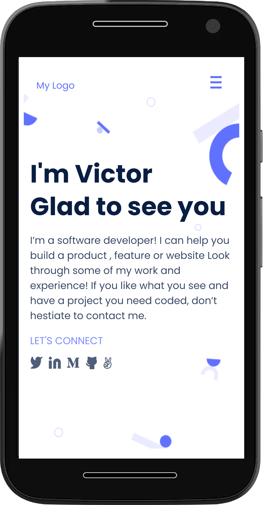
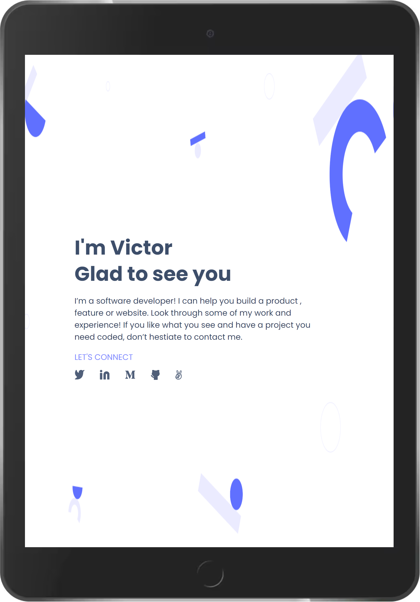

# My Portfolio Project

> This is my project for a Portfolio.   
It gives you a nice container for your different projects.  
It looks great on Desktop computers, Mobile phones, and Tablets.
## Mobile

## Tablet

## Widescreen

It is still a working project but you can watch a live demo here:  

[Live demo](https://vicperalta.github.io/Portfolio/)

## Built With

- HTML
- CSS
- JavaScript

## Authors

👤 **Victor Peralta**

- GitHub: [@VicPeralta](https://github.com/VicPeralta)
- Twitter: [@VicPeralta](https://twitter.com/VicPeralta)

👤 **Have-Samuel**
- GitHub: [@Have-Samuel](https://github.com/Have-Samuel)

👤 **Esteban Muñoz**
- GitHub: [@Estebanmual](https://github.com/Estebanmual)

## Show your support

Give a ⭐️ if you like this project!

## 📝 License

This project is [MIT](./LICENSE.md) licensed.